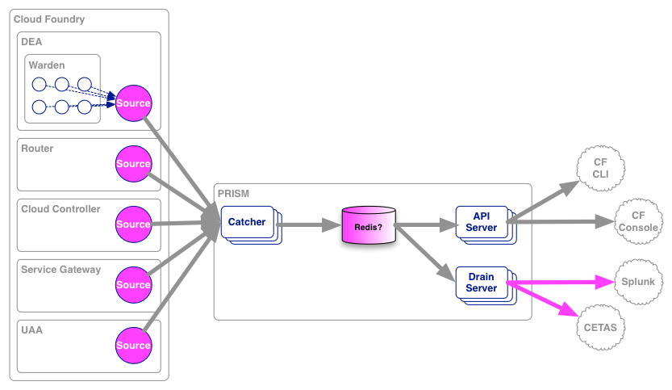

# PRISM

### Logging in the Clouds

###### [Tracker](https://www.pivotaltracker.com/s/projects/852691) | [Mailing List](mailto:cf-prism@pivotallabs.com)

PRISM is the user application logging subsystem for Cloud Foundry.

### Features

PRISM allows users to:

1. Tail their application logs.
1. Dump a recent set of application logs (where recent is on the order of an hour).
1. Continually drain their application logs to 3rd party log archive and analysis services.

### Usage

``` bash
$ cf logs --tail
Started GET "/" for 127.0.0.1 at 2013-04-05 13:14:58 -0700
Processing by Rails::WelcomeController#index as HTML
  Rendered /Users/tsaleh/.rbenv/versions/2.0.0-p0/lib/ruby/gems/2.0.0/gems/railties-4.0.0.beta1/lib/rails/templates/rails/welcome/index.html.erb (1.9ms)
Completed 200 OK in 12ms (Views: 11.3ms | ActiveRecord: 0.0ms)
Started GET "/assets/rails.png" for 127.0.0.1 at 2013-04-05 13:14:58 -0700
^C

$ cf logs --recent
Started GET "/" for 127.0.0.1 at 2013-04-05 13:14:58 -0700
Processing by Rails::WelcomeController#index as HTML
  Rendered /Users/tsaleh/.rbenv/versions/2.0.0-p0/lib/ruby/gems/2.0.0/gems/railties-4.0.0.beta1/lib/rails/templates/rails/welcome/index.html.erb (1.9ms)
Completed 200 OK in 12ms (Views: 11.3ms | ActiveRecord: 0.0ms)
Started GET "/assets/rails.png" for 127.0.0.1 at 2013-04-05 13:14:58 -0700

$
```

### Constraints

1. PRISM collects STDIN & STDOUT from the customer's application.  This may require configuration on the developer's side.
1. A PRISM outage must not affect the running application.
1. PRISM gathers and stores logs in a best-effort manner.  While undesirable, losing the current buffer of application logs is acceptable.
1. As much as possible, PRISM should be disconnected from the rest of Cloud Foundry.  Ideally, it's deployable outside of Cloud Foundry, entirely.
1. The 3rd party drain API should mimic Heroku's in order to reduce integration effort for our partners.  The Heroku drain API is simply remote syslog over TCP.

### Architecture

PRISM is composed of:

* **Sources**: Logging agents that run on the Cloud Foundry components.  They forward logs to:
* **PRISM Catcher**: Responsible for gathering logs from the **sources**, and storing in the temporary buffers.
* **PRISM Server**: Accepts connections from the `cf` CLI, allowing users to access their logs.
* **PRISM Drainer**: Implements the Heroku Drain API for 3rd party partners.

Source agents emit the logging data as [protocol-buffers](https://code.google.com/p/protobuf/), and the data stays in that format throughout the system.


