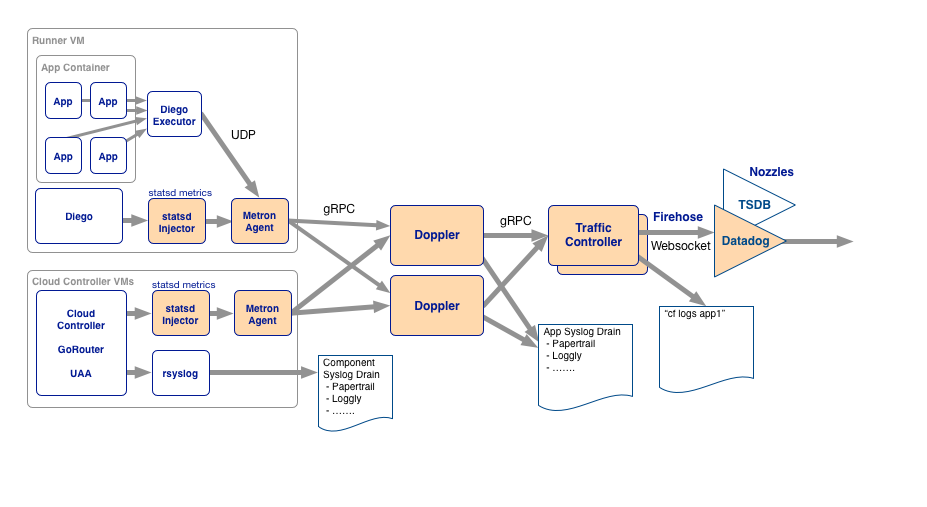

# Loggregator [](https://travis-ci.org/cloudfoundry/loggregator)
 
### Logging in the Clouds  
 
Loggregator is the user application logging subsystem for Cloud Foundry.


### Features

Loggregator allows users to:

1. Tail their application logs.
1. Dump a recent set of application logs (where recent is a configurable number of log packets).
1. Continually drain their application logs to 3rd party log archive and analysis services.

### Usage

First, make sure you're using the new [golang based CF CLI](https://github.com/cloudfoundry/cli).  Once that's installed:

```
cf logs [--app=APP_NAME] [--recent]
```

`APP_NAME` defaults to the current application in your `manifest.yml` file.

``` bash
$ cf logs private-app
Connected, tailing...
Oct 3 15:09:26 private-app App/0 STDERR This message is on stderr at 2013-10-03 22:09:26 +0000 for private-app instance 0
Oct 3 15:09:26 private-app App/0 STDERR 204.15.2.45, 10.10.2.148 - - [03/Oct/2013 22:09:26] "GET / HTTP/1.1" 200 81 0.0010
Oct 3 15:09:26 private-app App/0 This message is on stdout at 2013-10-03 22:09:26 +0000 for private-app instance 0
Oct 3 15:09:26 private-app App/0 STDERR This message is on stderr at 2013-10-03 22:09:26 +0000 for private-app instance 0
^C
```

### Constraints

1. Loggregator collects STDOUT & STDERR from the customer's application.  This may require configuration on the developer's side.
1. A Loggregator outage must not affect the running application.
1. Loggregator gathers and stores logs in a best-effort manner.  While undesirable, losing the current buffer of application logs is acceptable.
1. The 3rd party drain API should mimic Heroku's in order to reduce integration effort for our partners.  The Heroku drain API is simply remote syslog over TCP.

### Architecture

Loggregator is composed of:

* **Sources**: Logging agents that run on the Cloud Foundry components.  They forward logs to:
* **Loggregator Server**: Responsible for gathering logs from the **sources**, and storing in the temporary buffers.
* **Hashing Layer**: Makes the Loggregator Servers horizontally scalable by partitioning incoming log messages and outgoing traffic. Routes incoming log messages and proxies outgoing connections to the CLI and to drains for 3rd party partners.

Source agents emit the logging data as [protocol-buffers](https://code.google.com/p/protobuf/), and the data stays in that format throughout the system.



### Emitting Messages from other Cloud Foundry components

Cloud Foundry developers can easily add source clients to new CF components that emit messages to the loggregator server.  Currently, there are libraries for [Go](https://github.com/cloudfoundry/loggregatorlib/tree/master/emitter) and [Ruby](https://github.com/cloudfoundry/loggregator_emitter). For usage information, look at their respective READMEs.

### Deploying via BOSH

Below are example snippets for deploying the DEA Logging Agent (source), Loggregator Server, and Loggregator Router (hashing layer) via BOSH.

```yaml
jobs:
- name: dea_next
  template:
  - dea_next
  - dea_logging_agent
  instances: 1
  resource_pool: dea
  networks:
  - name: cf1
    default:
    - dns
    - gateway

- name: loggregator
  template: loggregator
  instances: 1  # Scale out as neccessary
  resource_pool: common
  networks:
  - name: cf1
    static_ips:
    - 10.10.16.14

- name: loggregator-trafficcontroller
  template: loggregator-trafficcontroller
  instances: 1  # Only one loggregator trafficcontroller per CF installation
  resource_pool: common
  networks:
  - name: cf1
    static_ips:
    - 10.10.16.16

properties:
  loggregator:
    trafficcontroller: 10.10.16.16:3456  # host:port that will receive messages emitted by Sources
    servers: 
    - 10.10.16.14:3456  # 
```

### Development

The Cloud Foundry team uses GitHub and accepts contributions via [pull request](https://help.github.com/articles/using-pull-requests).

Follow these steps to make a contribution to any of our open source repositories:

1. Complete our CLA Agreement for [individuals](http://www.cloudfoundry.org/individualcontribution.pdf) or [corporations](http://www.cloudfoundry.org/corpcontribution.pdf)
1. Set your name and email

    ```
    git config --global user.name "Firstname Lastname"
    git config --global user.email "your_email@youremail.com"
    ```

1. Fork the repo
1. Make your changes on a topic branch, commit, and push to github and open a pull request.

Once your commits are approved by Travis CI and reviewed by the core team, they will be merged.

#### Installing Go on OS X

Use brew and do

    brew install go --cross-compile-all

#### Checkout

```
git clone https://github.com/cloudfoundry/loggregator
cd loggregator
git submodule update --init
```

#### Running tests

```
bin/test
```

### Debugging


Loggregator will dump information about the running goroutines to stdout if sent a `USR1` signal.

```
goroutine 1 [running]:
runtime/pprof.writeGoroutineStacks(0xc2000bc3f0, 0xc200000008, 0xc200000001, 0xca0000c2001fcfc0)
	/home/travis/.gvm/gos/go1.1.1/src/pkg/runtime/pprof/pprof.go:511 +0x7a
runtime/pprof.writeGoroutine(0xc2000bc3f0, 0xc200000008, 0x2, 0xca74765c960d5c8f, 0x40bbf7, ...)
	/home/travis/.gvm/gos/go1.1.1/src/pkg/runtime/pprof/pprof.go:500 +0x3a
....
```

#### Development binary builds

Note: This is linux amd64 only

* [loggregator](https://dl.bintray.com/ajackson/loggregator/loggregator)
