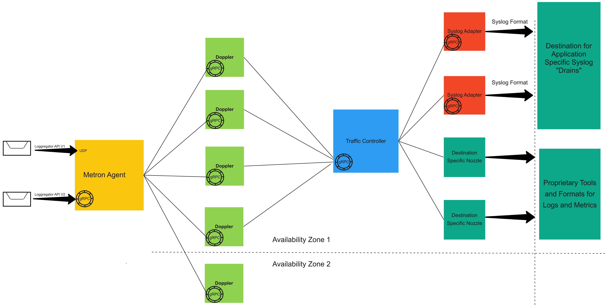

# Loggregator Design
Loggregator is a highly available and secure message transport system written in golang, leveraging the [grpc](http://www.grpc.io/) protocol. It accomplishes this by deploying a variety of components using [BOSH](http://bosh.io) properties.

## Design Restraints

### Highly Available Across Availability Zones

### No Backpressure on Applications

### Secure Transport

## Loggregator Components

### Diode Ring Buffer

### Metron Log Agent

### Doppler Log Forwader

### Traffic Controller 

### Syslog Adapter

### Friehose Nozzles

## Logs Outside the Firhose

