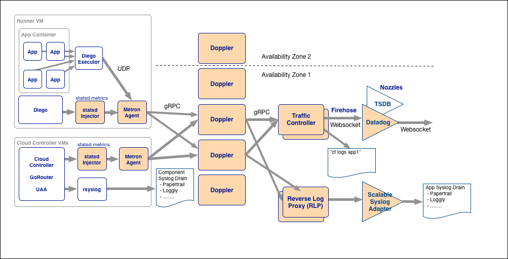

Loggregator uses a microservices design architecture, with several distinct components with the design goal of each component having a single metric to scale that component horizontally. Specific scaling recommendations are covered later in the document.

For a walk through fo a message delivery and monitoring approaches see this [video](https://www.youtube.com/watch?v=vR2wl22sU6Q)

**note** this diagram assumes the use of cf-deployment, cf-release is still using the following [design](./loggregator.png).

## Ring Buffer Circuit Breaker
In order to prevent disrupting application behavior or applying “backpressure” most of the Loggregator components share a common ring buffer data structure known as a “diode”. This diode utilizes separate read heads, and write heads and allows the components to handle faster writes than reads from within the Loggregator system. Each of these buffers emits metrics for ingress, egress, and dropped. 

## Metron Agent 
The metron agent process manages all ingress into the Loggregator system and must be co-located with any job that wants to emit metrics. The metron agent accomplishes this by listening on localhost for two protocols. The UDP protocols supports the use of the dropsonde protocol which is used to support many of the existing metrics on the platform. Recent versions of Metron Agent now also support the use of gRPC protocol using the go-loggregator client. This new protocol is being used for application logs from diego, and metrics from statsd-injector. Since this component is an agent collocated with other processes on the platform there are no scaling considerations. 
 
## Stads-injector
The statsd-injector is an optional job that supported that can be co-located with a process to support metrics using the statsd protocol. This component is maintained by the Loggregator team and uses the gRPC ingress point into Metron. Since this components is optionally colocated with the specific processes it does not have scaling considerations. 
Doppler Forwarder
The doppler component acts as a highly-available routing mechanism for logs and metrics flowing through loggregator. Each envelop that ingresses into Doppler is duplicated, and routed to multiple destinations known as sinks. The following is a breakdown of potential sinks each envelope can route to:
 
 - Logstream - The stream of logs used to support cf logs. 
 - Firehose - The aggregated stream of application logs and metrics
 - Reverse Log Proxy - Reverse proxy for logs bound to syslog drains
 - Recent Logs Cache - An in memory store for recent logs from a particular application guid.
 - Container Metrics Cache - Container metrics for an application used during cf push.
 
Doppler is scaling is complex, and relies on a variety of factors but, primarily it scales with the overall log and metric volume on your platform. 
 
## Traffic Controller
Traffic Controller manages the rate of egress from the Loggregator system for the Firehose and 'cf logs' stream. Additionally it provides the interface for container metrics and recent logs calls. Rather than using a diode it does this by notifying the system of slow consumers. 

## Syslog Drain Binders
The Reverse Log Proxy, and a set of additional components for syslog drain binders is managed in a seperate but releated release known as the [scalable syslog release](https://github.com/cloudfoundry/scalable-syslog-release). 
