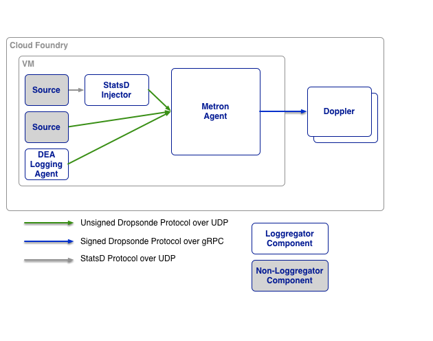

# Metron

Metron is a Cloud Foundry component that forwards logs and metrics into the
Loggregator subsystem by taking traffic from the various emitter sources (dea,
dea-logging-agent, router, etc) and routing that traffic to one or more
[dopplers](../doppler). An instance of Metron runs on each VM in an
environment and is therefore co-located on the emitter sources.

Traffic is routed to Dopplers in the same AZ, but it can fall back to any
Doppler if none are available in the current AZ. All Metron traffic is
randomly distributed across available Dopplers. Metron keeps track of healthy
dopplers by polling etcd for their health status.

Metron only listens to local network interfaces and all logs and metrics are
immediately signed before forwarding to Dopplers. This prevents
man-in-the-middle attacks and ensures data integrity.

## Architecture Within Loggregator

Source agents emit the logging data through the system as
[protocol-buffers](https://developers.google.com/protocol-buffers/) via the
[Dropsonde Protocol](https://github.com/cloudfoundry/dropsonde-protocol).
Metrics can also be emitted using statsd. The statsd metrics are forwarded to
Metron by the
[statsd-injector](https://github.com/cloudfoundry/statsd-injector)

## Editing Manifest Templates

The up-to-date Metron configuration can be found [in the metron spec
file](../jobs/metron_agent/spec). You can see a list of available
configurable properties, their defaults and descriptions in that file.

## Configuring Rsyslog (Deprecated)

Previous versions of Loggregator supported rsyslog, which was configured as
part of Metron. This feature is now deprecated in favor of
[syslog-release](https://github.com/cloudfoundry/syslog-release). The table
below maps old Metron properties for rsyslog to the new syslog-release
properties.

In the table below, all Metron properties have the prefix
`syslog_daemon_config`, e.g., `syslog_daemon_config.enable`. All
syslog-release properties have the prefix `syslog`, e.g., `syslog.address`.

| Metron Property     | Syslog Release Property |
|---------------------|-------------------------|
| enable              | N/A                     |
| address             | address                 |
| port                | port                    |
| transport           | transport               |
| fallback_addresses  | fallback_addresses      |
| custom_rule         | custom_rule             |
| max_message_size    | N/A                     |
