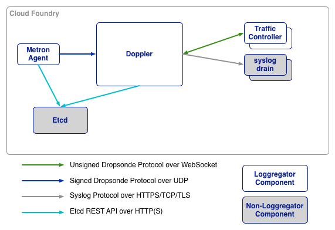

# Doppler

Doppler is a Cloud Foundry component that gathers logs and metrics from [Metron agents](../metron), stores them into temporary buffers, and forwards them to third-party syslog drains and other consumers.

Doppler scales horizontally &mdash; as load increases, more instances can be deployed to spread the load and decrease memory usage, CPU, etc. per Doppler. Metron agents are notified of the additional instances via updates to ```etcd```.

## Architecture Within Loggregator



Logging data passes through the system as [protocol-buffers](https://github.com/google/protobuf), using [Dropsonde](https://github.com/cloudfoundry/dropsonde).

In a redundant Cloud Foundry setup, Loggregator can be configured to survive zone failures. Log messages from non-affected zones will still make it to the end user. On AWS, availability zones could be used as redundancy zones.

## Usage
```
doppler [--logFile <path to log file>] [--config <path to config file>] \
    [--cpuprofile <path to desired CPU profile>] \
    [--memprofile <path to desired memory profile>]
```

| Flag               | Required                               | Description                                     |
|--------------------|----------------------------------------|-------------------------------------------------|
| ```--logFile```    | No, default: STDOUT                    | The agent log file.                             |
| ```--config```     | No, default: ```config/doppler.json``` | Location of the Doppler configuration JSON file. |
| ```--cpuprofile``` | No, default: no CPU profiling          | Write CPU profile to a file.                    |
| ```--memprofile``` | No, default: no memory profiling       | Write memory profile to a file.                 |

## Emitting Messages from the other Cloud Foundry components

Cloud Foundry developers can easily add source clients to new CF components that emit messages to Doppler.  Currently, there are libraries for [Go](https://github.com/cloudfoundry/dropsonde/). For usage information, look at its README.

## Editing Manifest Templates
The up-to-date Doppler configuration can be found [in the doppler spec file](../../../../jobs/doppler/spec). You can see a list of available configurable properties, their defaults and descriptions in that file.
