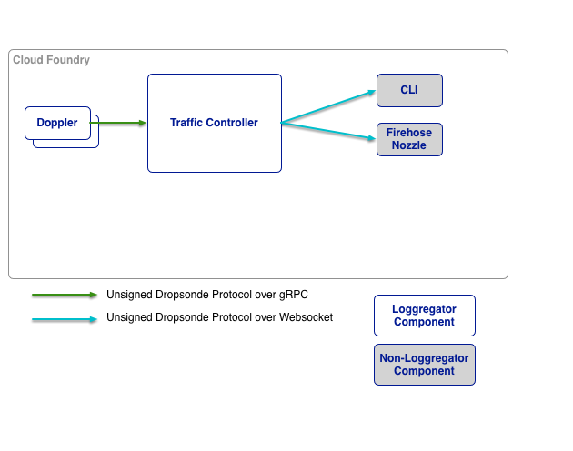

# Traffic Controller

Traffic Controller is a Cloud Foundry component that handles client requests for logs and metrics. It gathers and collates messages from all [Doppler](../doppler) servers, and provides an [external API](https://github.com/cloudfoundry/noaa) and message translation.

Traffic Controller handles inbound HTTP and WebSocket requests for log and metric data. It does this by proxying the request to all Dopplers (regardless of AZ). Since an application can be deployed to multiple AZs, its logs can potentially end up on Dopplers in multiple AZs. This is why the traffic controller will attempt to connect to Dopplers in each AZ and will collate the data into a single stream for the web socket client.

The Traffic Controller itself is stateless; an incoming request can be handled by any instance in any AZ. As such, Traffic Controller is horizontally scalable.

Traffic Controllers also expose a ```firehose``` web socket endpoint. Connecting to this endpoint establishes connections to all Dopplers, and streams logs and metrics for all applications and CF components. There are firehose examples within the [NOAA](https://github.com/cloudfoundry/noaa) library.

## Architecture Within Loggregator



Logging data passes through the system as [protocol-buffers](https://github.com/google/protobuf), using [Dropsonde](https://github.com/cloudfoundry/dropsonde).


## Usage
```
trafficcontoller [--logFile <path to log file>] [--config <path to config file>] \
    [--debug=<true|false>] [--cpuprofile <path to desired CPU profile>] \
    [--memprofile <path to desired memory profile>]
```

| Flag               | Required                               | Description                                     |
|--------------------|----------------------------------------|-------------------------------------------------|
| ```--logFile```    | No, default: STDOUT                    | The agent log file.                             |
| ```--config``` | No, default: ```config/loggregator_trafficcontroller.json``` | Location of the Traffic Controller configuration JSON file. |
| ```--debug```      | No, default: ```false```               | Debug logging                                   |
| ```--cpuprofile``` | No, default: no CPU profiling          | Write CPU profile to a file.                    |
| ```--memprofile``` | No, default: no memory profiling       | Write memory profile to a file.                 |
| ```--disableAccessControl``` | No, default: ```false```     | All clients' access to app logs                 |

## Editing Manifest Templates
The up-to-date Traffic-Controller configuration can be found [in the Traffic-Controller spec file](../../jobs/loggregator_trafficcontroller/spec). You can see a list of available configurable properties, their defaults and descriptions in that file. 
